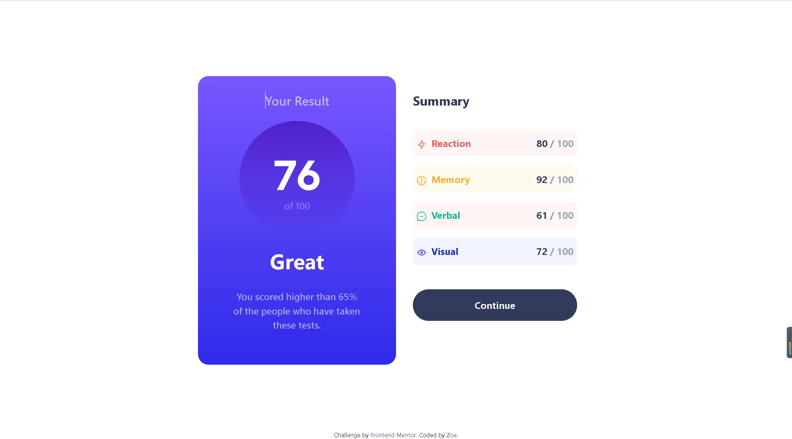

# Frontend Mentor - Results summary component solution

This is a solution to the [Results summary component challenge on Frontend Mentor](https://www.frontendmentor.io/challenges/results-summary-component-CE_K6s0maV). Frontend Mentor challenges help you improve your coding skills by building realistic projects. 

## Table of contents

- [Overview](#overview)
  - [The challenge](#the-challenge)
  - [Screenshot](#screenshot)
  - [Links](#links)
- [My process](#my-process)
  - [Built with](#built-with)
  - [What I learned](#what-i-learned)
  - [Continued development](#continued-development)
  - [Useful resources](#useful-resources)
- [Author](#author)
- [Acknowledgments](#acknowledgments)

**Note: Delete this note and update the table of contents based on what sections you keep.**

## Overview

### The challenge

Users should be able to:

- View the optimal layout for the interface depending on their device's screen size
- See hover and focus states for all interactive elements on the page
- **Bonus**: Use the local JSON data to dynamically populate the content

### Screenshot




### Links

- Solution URL: [Add solution URL here](https://your-solution-url.com)
- Live Site URL: [Add live site URL here](https://your-live-site-url.com)

## My process

### Built with

- Bootstrap


### What I learned

I practiced the method of using BootStrap to create responsive layout and brushed up on my previous knowledge.

Also, I learned how to set an adaptive circular components.

```html
<main class="container-fluid">
    <section class="row align-items-content justify-content-center">
      <div class="col-10 col-md-8 col-lg-6 px-0 board"></div>
    </section>
</main>

```
```css
#LeftPart .D-Score {
    position: relative;
    width: 70%;
    height: 0;
    padding-bottom: 35%;
    padding-top: 35%;
    border-radius: 50%;
}
```

### Useful resources

- [Bootstrap](https://getbootstrap.com/) - Responsive layout and other helpful Class


## Author

- Frontend Mentor - [LLL0908](https://www.frontendmentor.io/profile/LLL0908)

